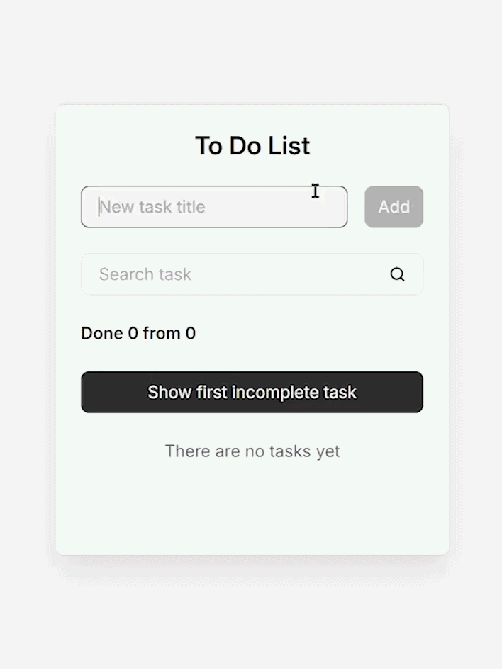

# To Do List

> A clean task manager built with React 19. Focused on component architecture, custom hooks, Context API, and working with a REST API.


## 📸 Preview



## 💡 About

A task management app built as a learning project to practice React fundamentals — component composition, custom hooks, Context API, and interacting with a REST API via JSON Server. No UI libraries — all styling is hand-written CSS with custom properties.

## ✨ Features

- Add, delete, and toggle tasks
- Search tasks with real-time filtering
- Navigate to individual task detail pages
- "Show first incomplete task" button with smooth scroll
- Delete all tasks with confirmation
- Persistent data via JSON Server

## 🛠 Tech Stack

- React 19
- Custom CSS (variables, BEM naming)
- Custom router (no React Router)
- Context API + custom hooks
- JSON Server (REST API mock)
- Vite 7

## 🎯 Technical Highlights

- **Custom router** — built from scratch using `popstate` event and pattern matching, no external routing library
- **Context API architecture** — `TasksProvider` wraps the app, exposing tasks, filters, and actions through a single context
- **Custom hooks** — `useTasks` encapsulates all task logic (CRUD, search, refs); `useInCompleteTaskScroll` handles scroll-to-first-incomplete; `useTasksLocalStorage` for persistence
- **Memoization** — `TodoItem` and `TodoList` wrapped in `memo()`, filtered tasks computed with `useMemo`, handlers stabilized with `useCallback`
- **Component composition** — small reusable pieces (`Field`, `Button`, `RouterLink`) composed into larger views

## 📁 Project Structure
src/
├── api/            # REST API layer (fetch wrapper for JSON Server)
├── components/     # UI components (Todo, TodoItem, TodoList, Field, Button)
├── context/        # TasksContext with Provider
├── hooks/          # useTasks, useInCompleteTaskScroll, useTasksLocalStorage
├── pages/          # TasksPage, TaskPage
├── styles/         # CSS modules (variables, globals, component styles)
├── Router.jsx      # Custom router implementation
└── App.jsx         # Route definitions

## 🚀 Run Locally

```bash
# Clone the repo
git clone https://github.com/ayanbaryshev02-dev/todo.git
cd todo

# Install dependencies
npm install

# Start JSON Server (port 3001)
npm run server

# In another terminal, start frontend (port 5173)
npm run dev
```

Open [http://localhost:5173](http://localhost:5173) in your browser.

## 📚 What I Learned

- **Custom routing** is surprisingly simple for basic cases — `popstate` + path matching covers most needs without a library.
- **Context API** works well for small apps but I can see how it would get unwieldy at scale — this experience helped me understand why Redux and Pinia exist.
- **`useCallback` and `useMemo`** aren't premature optimization when your list re-renders on every keystroke — they made a noticeable difference with search filtering.
- **Writing CSS from scratch** with BEM and custom properties gave me a deeper appreciation for utility frameworks like Tailwind.

## 👤 Author

**Ayan Baryshev**

- GitHub: [@ayanbaryshev02-dev](https://github.com/ayanbaryshev02-dev)
- LinkedIn: [ayan-baryshev](https://www.linkedin.com/in/ayan-baryshev-4a38a2366/)
- Telegram: [@Ayanbaryshev](https://t.me/Ayanbaryshev)
- Email: ayanbaryshev02@gmail.com